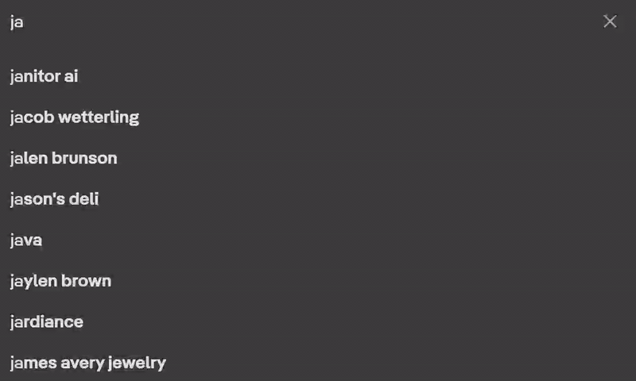

# fast-highlighter

Keyword highlighting userscript using the CSS Custom Highlight API, with a DOM fallback for older browsers. 
Organize keywords into color-coded categories. Highlights all matching instances of keywords across the page, defaults to case-insensitive whole word modes, with toggles for case sensitive and substring matching. Supports URL filtering for each category, and syncs across open tabs.

> Open the list manager with **Ctrl+Shift+U** | Toggle highlights on/off with **Ctrl+Shift+H**

## Install

Requires userscript manager such as:
 
- [Violentmonkey](https://violentmonkey.github.io/)
- [Tampermonkey](https://www.tampermonkey.net/)
- [Stay for Safari](https://apps.apple.com/us/app/stay-for-safari/id1591620171)

> [**Install fast-highlighter**](https://raw.githubusercontent.com/erichershman/fast-highlighter/main/fast-highlighter.user.js) Click to install directly.

## How it works

### CSS Custom Highlight API

On browsers that support it (Chrome 105+, Edge 105+), highlights are applied using the [CSS Custom Highlight API](https://developer.mozilla.org/en-US/docs/Web/API/CSS_Custom_Highlight_API). This paints highlights without touching the DOM. No elements are inserted or removed, preserving the original page structure.

The script runs at `document-start` and uses a `MutationObserver` to highlight new nodes as the parser streams them in, so highlighting begins before the page finishes loading.

### DOM fallback

On browsers without the Highlight API, matched text is wrapped in `` elements with inline styles. The fallback is fully reversible, spans are unwrapped and text nodes are normalized when highlights are cleared. 

### Keyword matching — Aho-Corasick

Keywords are compiled into an [Aho-Corasick automaton](https://en.wikipedia.org/wiki/Aho%E2%80%93Corasick_algorithm), a trie with failure links, so all keywords across all categories are matched in a single pass over each text node. Scan cost is O(n) in text length regardless of keyword count, which keeps performance stable whether you have 10 keywords or 10,000.

## TODO

- Allow for importing and exporting of keyword lists
- Regex keyword support

## License

[MIT](https://github.com/erichershman/fast-highlighter/blob/main/LICENSE)
